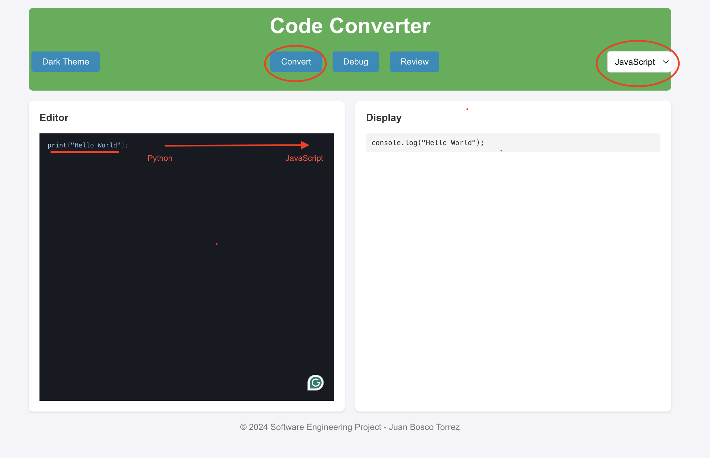
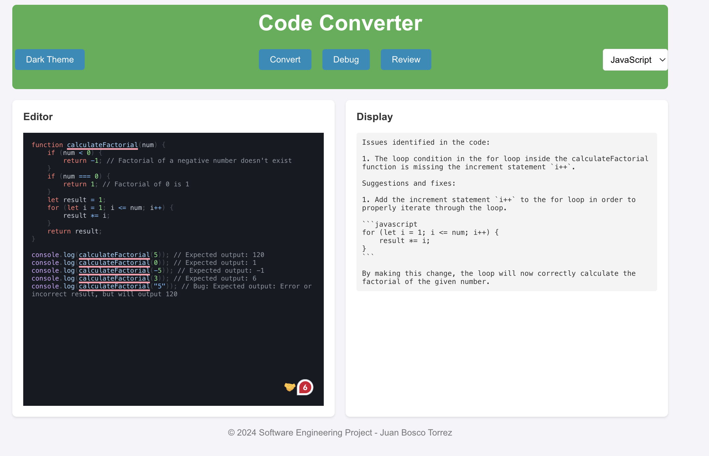

# Software Engineer Project - Web Application Code Quality and  Converter 💻

The primary objective of this project is to develop a web application that facilitates code
conversion between programming languages, leveraging the ChatGPT API. In addition, the
application aims to provide robust code debugging and code quality checking features. This tool
will assist developers in seamlessly transitioning code across different languages, improving code
quality, and identifying potential bugs early in the development process.


## Screenshots 📸





## Project Structure 🧩


```bash
  your-repo/
│
├── backend/
│   ├── src/
│   ├── pom.xml
│   └── ...
│
├── frontend/
│   ├── public/
│   ├── src/
│   ├── package.json
│   └── ...
│
└── README.md

```
## Want To check the site? 👀
[Click Here ](https://softwareenginneringprojectclass.netlify.app/) 

## Prerequisite 💡
[Java Development Kit (JDK) 17 ](https://www.oracle.com/java/technologies/javase/jdk17-archive-downloads.html) 

[Apache Maven ](https://maven.apache.org/install.html)

[NodeJS ](https://nodejs.org/en)


## Installation 🛠️

1. Clone Repository

```bash
git clone https://github.com/your-username/my-node-project.git
cd my-node-project
```
2. Navigate to the Backend directory
```bash
cd backend
```
3. Run the Backend
```bash
mvn spring-boot:run

```
4. Open a new terminal and Navigate to the frontend Directory
```bash
cd frontend

```
5. Install Dependencies
```bash
npm install

```
5. Run the Frontend Server
```bash
npm start


```

### (Alternative) Run Project using docker 🐳

1. Open the docker-compose.yml file found in the root directory and add your own OpenAi API key
```bash
OPENAI_API_KEY=your_openai_api_key_here

```
2. Open a new terminal, in your root directory and run the following command
```bash
docker-compose up

```
2. Open your web browser
```bash
http://localhost:3000/

```

## OpenAI API Key 🤖

Alternatively, to run this project, you can manually add your own Openai KEY following this path:

`Backend -> src -> main -> java -> resources -> aplication.properties`

`Navigate to that directory and add your own API key. You can find your own Key 
in the official site of OpenAi`


## Acknowledgements 📚

 - [React Documentation](https://react.dev/reference/react)
 - [Monaco editor wintegration with any React application ](https://github.com/suren-atoyan/monaco-react)
 - [Axios Documentation](https://axios-http.com/docs/intro)
 - [Lombok Documentation](https://projectlombok.org/)
 - [Spring Boot Documentation](https://spring.io/projects/spring-boot)
 - [Maven Documentation](https://maven.apache.org/guides/index.html)


[](https://choosealicense.com/licenses/mit/)

